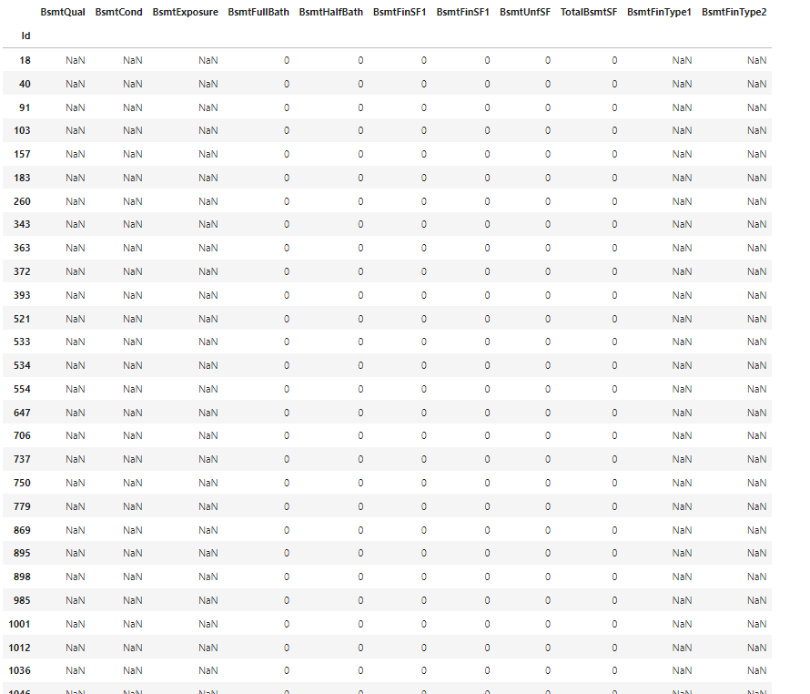
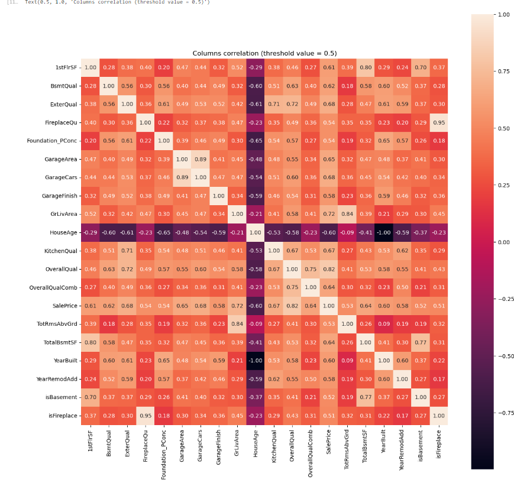

# Advanced Regression Techniques (Boston House Prices)

### House prices predictions

## **Table of contents** 

1. [Introduction](#introduction)
    * [Project's objective](#projects-objective)
    * [The environment used](#the-environment-used)
        * [Limitations](#limitations)
    * [Technologies used](#technologies-used)
2. [Data description](#data-description)
3. [Exploratory Data Analysis (EDA)](#exploratory-data-analysis-eda)
4. [Visualizing nulls](#visualizing-nulls)
5. [Visualizing numeric features](#visualizing-numeric-features)
6. [Data preprocessing](#data-preprocessing)
    * [Dealing with outliers](#a-dealing-with-outliers)
    * [Dealing with missing values](#b-dealing-with-missing-values)
    * [Feature scaling](#c-feature-scaling)
    * [Dealing with categoricals](#c-dealing-with-categoricals)
    * [Feature Engineering](#e-feature-engineering)
    * [Multicollinearity](#f-multicollinearity)
7. [Splitting the data](#7-splitting-the-data)
8. [The main function](#8-the-main-function)
9. [Modeling Approach](#9-modeling-approach)
    * [Random Forest](#a-first-model-to-try-random-forest)
    * [AdaBoost](#b-second-model-adaboost)
    * [LGBM](#c-third-model-lgbm)
    * [XGBoost](#d-the-fourth-model-xgboost)
10. [Enhancing the results](#10-enhancing-the-results)
    * ["Fine-tune" outliers](#a-fine-tune-outliers)
    * [Cross-validation size](#b-cross-validation-size)
    * ["Fine-tuning" the feature engineering function](#c-fine-tuning-the-feature-engineering-function)
    * [Experimenting with the test size](#d-experimenting-with-the-test-size)
11. [Fine-tuning the models](#11-fine-tuning-the-models)
12. [Ensembling](#12-ensembling)
13. [Conclusion](#13-conclusion)
14. [Submission](#14-submission)
15. [File structure and description](#15-file-structure-and-description)
16. [About author](#16-about-author)
17. [References](#17-references)


## Introduction
The task is given by a data science competition platform and online community for data scientists and machine learning practitioners - Kaggle. [A link to the competition](https://www.kaggle.com/competitions/house-prices-advanced-regression-techniques/overview).

### Project's objective
The objective of the project is to predict the sales price for each house. For each Id in the test set, the value of the SalePrice variable has to be predicted. 

### The environment used
The Kaggle platform is chosen due to the accessibility of both free CPU and GPU resources.

#### Limitations
We are limited in terms of GPU by 30 hours per week by the Kaggle platform. Additionally, the system tends to terminate long-run sessions (multiple-epoch trainings) or freezes when the tab is inactive. It restricts the RAM usage as well, meaning the high resolution images or large batch sizes would not be able to be processed either.


### Libraries used
```python
# Import necessary libraries for data manipulation and analysis
import numpy as np  # NumPy for numerical operations and array handling
import pandas as pd  # Pandas for data manipulation and analysis

# Import OS module for file path manipulation
import os  # To handle file paths and directory operations

# Import visualization libraries
import matplotlib.pyplot as plt  # Matplotlib for creating static, animated, and interactive visualizations
import seaborn as sns  # Seaborn for statistical data visualization, built on top of Matplotlib
from scipy import stats  # SciPy for scientific and technical computing, including statistical functions

# Import functions for model selection and evaluation
from sklearn.model_selection import train_test_split  # For splitting datasets into training and testing sets
from sklearn.model_selection import cross_val_score  # For performing cross-validation on models

# Import regression models
from sklearn.ensemble import RandomForestRegressor  # Random Forest model for regression tasks
from sklearn.ensemble import AdaBoostRegressor  # AdaBoost model for boosting weak learners
import lightgbm as lgb  # LightGBM for gradient boosting on decision trees
import xgboost as xgb  # XGBoost for extreme gradient boosting

# Import base classes for custom transformers and estimators
from sklearn.base import BaseEstimator, TransformerMixin  # Base classes for building custom estimators

# Import metrics for model evaluation
from sklearn.metrics import mean_squared_error  # For calculating mean squared error (MSE) of predictions

# Import ensemble methods for combining multiple models
from sklearn.ensemble import VotingRegressor  # For combining multiple regression models

# Import feature selection methods
from sklearn.feature_selection import SelectKBest, f_regression  # For selecting the best features based on regression tests

# Import preprocessing utilities
from sklearn.preprocessing import StandardScaler  # For standardizing features by removing the mean and scaling to unit variance
```

## Data description
The data is a set of sold houses. The detailed data description can be found [here](https://www.kaggle.com/competitions/house-prices-advanced-regression-techniques/data).

## Exploratory Data Analysis (EDA)
First step - consistency. Check if we have any duplicates within the datasets and in relation to each other.
```python
# check for duplicates between test and train
print(f"train duplicates = {len(train[train.duplicated()])} rows")
print(f"test duplicates = {len(test[test.duplicated()])} rows")
print(f"train in test duplicates = {len(train[train.isin(test).all(axis=1)])} rows")
```
#### Output:
```
train duplicates = 0 rows
test duplicates = 0 rows
train in test duplicates = 0 rows
```

## Visualizing nulls
Now, we want to inquire about a lack of data (NULLs). It is crucial to consider it before we look into distributions / outliers / skewness.

#### Getting all categorical feature nulls; sorted:
```python
# print object feature nulls
object_features = [feat for feat in train.columns if train[feat].dtype == "O"]

get_NA_info(object_features)
```
### Output:


#### Getting all numeric feature nulls; sorted:
```python
# # print numeric feature nulls
numeric_features = [feat for feat in train.columns if feat not in {"Id", "SalePrice"} and train[feat].dtype != "O"]

get_NA_info(numeric_features)
```
### Output:


## Visualizing numeric features
Now that we have our preparations done, it is high time we looked at the data visually. While plotting, the transformation is done by using the $y = log(1+x)$ function. Both versions (with the function and without) are shown only for education purposes and for the author's own readability and assessment. The nature of it aids in bringing the feature closer to Normal distribution (next ND). The latter is helpful:
- to understand the logic of imputation missing values (whether it is mean / median / mode etc. for Normal or advanced tree-based inputers for more irregular ones);
- knowing if models that assume the data is normally distributed are useless (simple linear ones are unlikely to show any significant performance in complex patterns; ANOVA);
- ND can improve performance, especially of distance-based methods (e.g., k-NN, SVM), as well as for Linear models.
- Algorithms can converge faster / better being on the similar scale around 0, while not ever be 0 (not to exclude anything)

5 types of plots are built for each feature:
- histplot - helps us understand the respective feature distribution
- probplot - QQ-plot to get a better understanding of how close it is to normal distribution
- histplot - rebuilding the first plot while applying the log(1+x) function
- probplot - rebuilding the second plot while applying the log(1+x) function
- scatterplot - helps to visually discern outliers (as more precise methods like Boxplots, IQR, Z-score are tend to remove too much data)

```python
plot_all_numeric_features()
```
#### Output (first 3 features + the target (SalePrice)):


## Data preprocessing
### a. Dealing with outliers
Before we deal with nulls, we will look into outliers not to consider them during the calculation of central tendencies of numerical imputations (especially mean that is vulnerable to extreme values).

As we don't have much data, we will not get into any interquartile ranges, boxplots nor z-scores. They always suggest removing huge chunks of essential data. Our approach is more practical and it involves assessing them visualliy based on the scatter plots we have built. To still have variability and flexibility, we create 3 different functions to remove outliers: 
- handle_outliers_strict - the most harsh outlier removal
- handle_outliers_moderate - medium strictness
- handle_outliers_light - light removal (only the most obvious ones)

Ones that are <b>different</b> throughout the functions (remove with values that are <u>bigger</u> than ...):

| Feature | Strict | Moderate | Light |
|---------|--------|----------|-------|
| LotArea | 100_000 | 140_000 | 200_000 |
| MasVnrArea | 100_000 | 140_000 | 200_000 |
| GrLivArea | 4000 | 4000 | 5000 |
| OpenPorchSF | 420 | 450 | 500 |
| 3SsnPorch | 400 | 400 | 500 |
| PoolArea | 550 | 600 | 650 |

Overall:
```python
handle_outliers_strict(train) # removes 22 outliers
handle_outliers_moderate(train) # removes 20 outliers
handle_outliers_light(train) # removes 15 outliers
```

### b. Dealing with missing values
Next step is dealing with nulls. Each feature has to be considered separately, but we will be taking only those features that are easy to impute. For more advanced ones we would first need to handle the categorical values:

#### OBJECT FEATURES:

a. 'PoolQC' - train missing 1453 / 1460, test missing 1456 / 1459. The docs states 'NA' stands for 'no pool', but as we are unable to say what the rest is, also due to its imbalance, it's dropped from both sets. Some of the next dropped features follow the same logic, it is not being mentioned again;

b. 'MiscFeature' - 1453/1460 is missing, dropped;

c. 'Alley' - 1369/1460 is missing, dropped;

d. 'Fence' - train don't have 1179/1460 fences, test - 1169 / 1459; nulls replaced with "NA" according to the docs;

```python
train.loc[train['Fence'].isna(), 'Fence'] = 'NA'
test.loc[test['Fence'].isna(), 'Fence'] = 'NA'
```

e. 'FireplaceQu' - train don't have 690/1460 fireplaces, test - 730 / 1459; nulls replaces with "NA";

```python
train.loc[train['FireplaceQu'].isna(), 'FireplaceQu'] = 'NA'
test.loc[test['FireplaceQu'].isna(), 'FireplaceQu'] = 'NA'
```

f. 'GarageFinish', 'GarageQual', 'GarageCond', 'GarageType' - for train 81/1460, test - 76+/1459. Confirming that these 81 rows are the same:
```python
print(train.query("GarageFinish.isna() & GarageQual.isna() & GarageCond.isna() & GarageType.isna()")[['GarageType', 'GarageYrBlt', 'GarageFinish', 'GarageCars', 'GarageArea', 'GarageQual', 'GarageCond']]) # returned 81 rows
```
#### Output:


All 'GarageArea' are '0', so there are no garages:
```python
train_no_garages_idxs = train.query("GarageFinish.isna() & GarageQual.isna() & GarageCond.isna() & GarageType.isna()").index
train.loc[train_no_garages_idxs, 'GarageType'] = 'NA'
train.loc[train_no_garages_idxs, 'GarageYrBlt'] = 0.0
train.loc[train_no_garages_idxs, 'GarageFinish'] = 'NA'
train.loc[train_no_garages_idxs, 'GarageQual'] = 'NA'
train.loc[train_no_garages_idxs, 'GarageCond'] = 'NA'
```

Same for the test set:
```python
print(test.query("GarageFinish.isna() & GarageQual.isna() & GarageCond.isna() & GarageType.isna()")[['GarageType', 'GarageYrBlt', 'GarageFinish', 'GarageCars', 'GarageArea', 'GarageQual', 'GarageCond']]) # 76 rows are common and don't have a garage
test_no_garages_idxs = test.query("GarageFinish.isna() & GarageQual.isna() & GarageCond.isna() & GarageType.isna()").index
test.loc[test_no_garages_idxs, 'GarageType'] = 'NA'
test.loc[test_no_garages_idxs, 'GarageYrBlt'] = 0.0
test.loc[test_no_garages_idxs, 'GarageFinish'] = 'NA'
test.loc[test_no_garages_idxs, 'GarageQual'] = 'NA'
test.loc[test_no_garages_idxs, 'GarageCond'] = 'NA'
```

Visualizing the rest of the nulls with get_NA_info(object_features), we manually look at the leftover ones both of which has a garage:
```python
print(test.query("GarageFinish.isna() & GarageQual.isna() & GarageCond.isna()")[['GarageType', 'GarageYrBlt', 'GarageFinish', 'GarageCars', 'GarageArea', 'GarageQual', 'GarageCond']]) # return 2 leftover nulls
```
#### Output:


According to the most frequent values of the years, these kinds of houses were built around 1920 (most likely) and 1939. Therefore, it is thought the data is missing due to the houses' being too old to date it.

```python
# take the mean of 5 most popular old house garage years
print(test[(test['GarageType']=='Detchd')]['GarageYrBlt'].value_counts().head(5).index.values.mean()) # prints 1933

# impute the mean
test.loc[test['GarageYrBlt'].isna(), 'GarageYrBlt'] = 1933

# observe the mode of old house garages with 'GarageType'=='Detchd'
print(test[(test['GarageType']=='Detchd') & (test['GarageYrBlt'] < 1950.0)]['GarageFinish'].value_counts())

# impute the mode
test.loc[test['GarageFinish'].isna(), 'GarageFinish'] = 'Unf'

# observe the mode of old house garages for 'GarageCars'
print(test[(test['GarageType']=='Detchd') & (test['GarageYrBlt'] < 1950.0)]['GarageCars'].value_counts())

# impute the mode
test.loc[test['GarageCars'].isna(), 'GarageCars'] = 1.0

# take the mean of 4 most common old house garages SF
print(test[(test['GarageType']=='Detchd') & (test['GarageYrBlt'] < 1950.0)]['GarageArea'].value_counts().head(4).index.values.mean()) # prints 231

# impute the mean
test.loc[test['GarageArea'].isna(), 'GarageArea'] = 231.0

# observe the mode of old house garages with common SF for 'GarageQual'
print(test[(test['GarageType']=='Detchd') & (test['GarageYrBlt'] < 1950.0) & (test['GarageArea'] <= 400.0)]['GarageQual'].value_counts())

# impute the mean
test.loc[test['GarageQual'].isna(), 'GarageQual'] = "TA"

# observe the mode of old house garages with common SF for 'GarageCond'
test[(test['GarageType']=='Detchd') & (test['GarageYrBlt'] < 1950.0) & (test['GarageArea'] <= 400.0)]['GarageCond'].value_counts()

# impute the mean
test.loc[test['GarageCond'].isna(), 'GarageCond'] = "TA"
```

g. 'BsmtExposure', 'BsmtFinType2', 'BsmtCond', 'BsmtQual', 'BsmtFinType1' - have the same kind of discrepancy. Train set - 38 and 37 nulls, Test set - 42, 44 and 45 nulls.
```python
print(train.query("BsmtExposure.isna() & BsmtFinType2.isna() & BsmtCond.isna() & BsmtQual.isna() & BsmtFinType1.isna() & BsmtFinType1.isna() & BsmtFinType2.isna()")[['BsmtQual', 'BsmtCond', 'BsmtExposure', 'BsmtFullBath', 'BsmtHalfBath', 'BsmtFinSF1', 'BsmtFinSF1', 'BsmtUnfSF', 'TotalBsmtSF', 'BsmtFinType1', 'BsmtFinType2']])
```
#### Output:


Therefore, these 37 don't have a basement.

```python
train_bsmt_common_nulls_idxs = train.query("BsmtExposure.isna() & BsmtFinType2.isna() & BsmtCond.isna() & BsmtQual.isna() & BsmtFinType1.isna()").index
train.loc[train_bsmt_common_nulls_idxs, 'BsmtQual'] = 'NA'
train.loc[train_bsmt_common_nulls_idxs, 'BsmtCond'] = 'NA'
train.loc[train_bsmt_common_nulls_idxs, 'BsmtExposure'] = 'NA'
```
We are left with two more nulls ('BsmtExposure' and 'BsmtFinType2'), where basements are obviously present.

According to the data, 67% of basements have 'BsmtExposure' = 'No' and 86% of 'BsmtFinType2' = 'Unf', we will impute the mode:
```python
train.loc[train['BsmtExposure'].isna(), 'BsmtExposure'] = 'No'
train.loc[train['BsmtFinType2'].isna(), 'BsmtFinType2'] = 'Unf'
```

We do similarly for the test set, 42 nulls are common and 1 of them has no information about the basement. As this is a test set and we cannot drop anything, we will impute the mode.

```python
test_bsmt_common_nulls_idxs = test.query("BsmtExposure.isna() & BsmtFinType2.isna() & BsmtCond.isna() & BsmtQual.isna() & BsmtFinType1.isna()").index
test.loc[test_bsmt_common_nulls_idxs, 'BsmtQual'] = 'NA'
test.loc[test_bsmt_common_nulls_idxs, 'BsmtCond'] = 'NA'
test.loc[test_bsmt_common_nulls_idxs, 'BsmtExposure'] = 'NA'
test.loc[test_bsmt_common_nulls_idxs, 'BsmtFullBath'] = 0.0
test.loc[test_bsmt_common_nulls_idxs, 'BsmtHalfBath'] = 0.0
test.loc[test_bsmt_common_nulls_idxs, 'BsmtFinType1'] = 'NA'
test.loc[test_bsmt_common_nulls_idxs, 'BsmtFinType2'] = 'NA'

# get the rows with similar parameters for 'BsmtExposure'
print(test[(test['BsmtQual'] == "Gd") & (test['BsmtCond'] == "TA")]['BsmtExposure'].value_counts())

# impute the mode
test.loc[test['BsmtExposure'].isna(), 'BsmtExposure'] = "NO"

# get the rows with similar parameters for 'BsmtQual'
print(test[((test['BsmtCond'] == "Fa") | (test['BsmtCond'] == "TA")) & 
     (test['BsmtFullBath'] == 0.0) & 
     (test['BsmtFinType1'] == "Unf") & 
     (test['BsmtHalfBath'] == 0.0) &
     (test['BsmtFinSF1'] == 0.0) &
     (test['BsmtFinSF2'] == 0.0) &
     (test['TotalBsmtSF'] < 400.0) &
     (test['BsmtUnfSF'] < 400.0) &
     (test['BsmtFinType2'] == "Unf")]['BsmtQual'].value_counts())

# impute the mode
test.loc[test['BsmtQual'].isna(), 'BsmtQual'] = "Gd"

# get the rows with similar parameters for 'BsmtCond'
print(test[((test['BsmtQual'] == "Gd") | (test['BsmtQual'] == "TA")) & 
     ((test['BsmtExposure'] == "Mn") | (test['BsmtExposure'] == "No") | (test['BsmtExposure'] == "Av")) & 
     ((test['BsmtFinType1'] == "GLQ") | (test['BsmtFinType1'] == "BLQ") | (test['BsmtFinType1'] == "ALQ")) & 
     ((test['BsmtFinType2'] == "Rec") | (test['BsmtFinType2'] == "Unf")) & 
     (test['TotalBsmtSF'] > 900.0) & (test['TotalBsmtSF'] < 1500.0)]['BsmtCond'].value_counts())

# impute the mode
test.loc[test['BsmtCond'].isna(), 'BsmtCond'] = "TA"

# get the rows with similar parameters for 'BsmtFinSF1'
print(test[(test['BsmtFullBath']==0.0) & (test['BsmtHalfBath'] == 0.0) & (test['BsmtQual']=='NA') & (test['BsmtCond']=='NA') & (test['BsmtExposure']=='NA')]['BsmtFinSF1'].value_counts())

# impute the mode
test.loc[test['BsmtFinSF1'].isna(), 'BsmtFinSF1'] = 0.0

# get the rows with similar parameters for 'BsmtFinSF2'
print(test[(test['BsmtFullBath']==0.0) & (test['BsmtHalfBath'] == 0.0) & (test['BsmtQual']=='NA') & (test['BsmtCond']=='NA') & (test['BsmtExposure']=='NA')]['BsmtFinSF2'].value_counts())

# impute the mode
test.loc[test['BsmtFinSF1'].isna(), 'BsmtFinSF2'] = 0.0

# get the rows with similar parameters for 'BsmtUnfSF'
print(test[(test['BsmtFullBath']==0.0) & (test['BsmtHalfBath'] == 0.0) & (test['BsmtQual']=='NA') & (test['BsmtCond']=='NA') & (test['BsmtExposure']=='NA')]['BsmtUnfSF'].value_counts())

# impute the mode
test.loc[test['BsmtUnfSF'].isna(), 'BsmtUnfSF'] = 0.0

# get the rows with similar parameters for 'TotalBsmtSF'
print(test[(test['BsmtFullBath']==0.0) & (test['BsmtHalfBath'] == 0.0) & (test['BsmtQual']=='NA') & (test['BsmtCond']=='NA') & (test['BsmtExposure']=='NA')]['TotalBsmtSF'].value_counts())

# impute the mode
test.loc[test['TotalBsmtSF'].isna(), 'TotalBsmtSF'] = 0.0
```

h. 'MasVnrType' - 8/1460 are missing. The docs do not describe 'NA' as an option (on the contrary the 'None' value stand for 'No masonry' here), therefore we replace all nulls with a mode again, which is 'None':
```python
train.loc[train['MasVnrType'].isna(), 'MasVnrType'] = 'None'
test.loc[test['MasVnrType'].isna(), 'MasVnrType'] = 'None'
```
i. 'Electrical' - 1 / 1460 is missing. Similar to the previous one, 'NA' is not an option.
```python
train.loc[train['Electrical'].isna(), 'Electrical'] = 'SBrkr'
```

j. 'MSZoning' - 4/1459 (test) are missing. Similar to the previous one, 'NA' is not an option.
``` python
test.loc[test['MSZoning'].isna(), 'MSZoning'] = 'RL'
```

k. 'Utilities' - 2 / 1459 (test) are missing. Similar to the previous one, 'NA' is not an option.
```python
test.loc[test['Utilities'].isna(), 'Utilities'] = 'AllPub'
```

l. 'Functional' - 2 / 1459 (test) are missing. Similar to the previous one, 'NA' is not an option.
```python
test.loc[test['Functional'].isna(), 'Functional'] = 'Typ'

train.loc[train['Exterior1st']=='Brk Cmn', 'Exterior1st'] = 'BrkComm'
train.loc[train['Exterior1st']=='CmentBd', 'Exterior1st'] = 'CemntBd'
train.loc[train['Exterior1st']=='Wd Shng', 'Exterior1st'] = 'WdShing'

test.loc[test['Exterior1st']=='Brk Cmn', 'Exterior1st'] = 'BrkComm'
test.loc[test['Exterior1st']=='CmentBd', 'Exterior1st'] = 'CemntBd'
test.loc[test['Exterior1st']=='Wd Shng', 'Exterior1st'] = 'WdShing'
```

m. 'Exterior1st' - 1 / 1459 (test) is missing. Similar to the previous one, 'NA' is not an option.
```python
test.loc[test['Exterior1st'].isna(), 'Exterior1st'] = 'VinylSd'
```

n. 'Exterior2nd' - 1 / 1459 (test) is missing. Similar to the previous one, 'NA' is not an option.
```python
test.loc[test['Exterior2nd'].isna(), 'Exterior2nd'] = 'VinylSd'
```

Also, according to the docs this feature has a limited set of values. However, factually, there are more. Considering these typos, let us correct them.

#### Images (list of 'Exterior2nd' values from the docs compared to factual values in the train and test respectively):
<table>
  <tr>
    <td valign="top" width="300"></td>
  </tr>
  <tr>
    <td valign="top"></td>
    <td valign="top" width="330"></td>
    </tr>
</table>

Consequently, 

```python
print(set(test['Exterior1st'].unique()).symmetric_difference(set(test['Exterior2nd'].unique())) 
{'Brk Cmn','BrkComm','CemntBd','CmentBd','ImStucc','Stone','Wd Shng','WdShing'}) #  unique values between Exterior1st and Exterior2nd (they are meant to be the same)

train.loc[train['Exterior2nd']=='Brk Cmn', 'Exterior2nd'] = 'BrkComm'
train.loc[train['Exterior2nd']=='CmentBd', 'Exterior2nd'] = 'CemntBd'
train.loc[train['Exterior2nd']=='Wd Shng', 'Exterior2nd'] = 'WdShing'
            
test.loc[test['Exterior2nd']=='Brk Cmn', 'Exterior2nd'] = 'BrkComm'
test.loc[test['Exterior2nd']=='CmentBd', 'Exterior2nd'] = 'CemntBd'
test.loc[test['Exterior2nd']=='Wd Shng', 'Exterior2nd'] = 'WdShing'
```

o. 'KitchenQual' - 1 / 1459 (test) is missing. Similar to the previous one, 'NA' is not an option.
```python
test.loc[test['KitchenQual'].isna(), 'KitchenQual'] = 'TA'
```

p. 'SaleType' - 1 / 1459 (test) is missing. Similar to the previous one, 'NA' is not an option.
```python
test.loc[test['SaleType'].isna(), 'SaleType'] = 'WD'
```
NUMERIC FEATURES

a. 'LotFrontage' - 259 / 1460 are missing for train, 227 / 1459 - for test. Its distribution is normal, not skewed. We use median.
```python
_train.loc[_train['LotFrontage'].isna(), 'LotFrontage'] = _train['LotFrontage'].median()
_test.loc[_test['LotFrontage'].isna(), 'LotFrontage'] = _test['LotFrontage'].median()
```
b. 'GarageYrBlt' - was discussed in the previous section.

c. 'MasVnrArea' - looks like multimodal / bimodal; left-skewed. However, it has 849 '0' values which indicates the absence of a masonry. We will separate it into another column named 'isMas', where '1' indicates its presence, '0' - absence.
```python
_train['isMas'] = _train['MasVnrArea'].apply(lambda x: 1 if x > 0 else 0)
```
 Also, 'MasVnrType' column we had imputed claims the rows with nulls have the 'None' type. It testifies that the null areas are meant to be '0'. It is also the case for the test set:
 ```python
MasVnrAreaNullsIdxsTrain = train[train['MasVnrArea'].isna()].index
print(train[MasVnrAreaNullsIdxsTrain][['MasVnrType', 'MasVnrArea']])
train.loc[MasVnrAreaNullsIdxsTrain, 'MasVnrArea'] = 0

MasVnrAreaNullsIdxsTest = test[test['MasVnrArea'].isna()][['MasVnrArea', 'MasVnrType']].index
print(test[MasVnrAreaNullsIdxsTest][['MasVnrArea', 'MasVnrType']])
test.loc[MasVnrAreaNullsIdxsTest, 'MasVnrArea'] = 0
 ```
#### Output (test and train respectively):
<table>
  <tr>
    <td valign="top"></td>
    <td valign="top"></td>
  </tr>
</table>

d. 'BsmtFullBath', 'BsmtHalfBath', 'BsmtFinSF1', 'BsmtFinSF1', 'BsmtUnfSF', 'TotalBsmtSF' - have 2 common rows with nulls. If we print them with all other basement-regarding rows, we will see that these indeed do not have a basement:
```python
print(test[test['BsmtFullBath'].isna()][['BsmtQual', 'BsmtCond', 'BsmtExposure', 'BsmtFullBath', 'BsmtHalfBath', 'BsmtFinSF1', 'BsmtFinSF1', 'BsmtUnfSF', 'TotalBsmtSF']])
```
#### Output:


That's why:
```python
test.loc[test['BsmtFullBath'].isna(), ['BsmtFullBath', 'BsmtHalfBath', 'BsmtFinSF1', 'BsmtFinSF1', 'BsmtUnfSF', 'TotalBsmtSF']] = 0.0
```
## c. Feature scaling
There are algorithms (such as tree-based for instance) that do not require this step, but its standardizing and removing skewness can improve convergence and the outcome result. Despite the algorithm, it is crucial to do so with the target. According to the plot, it is right skewed, so we will use natural properties of log(1+x) function to "align" it and also scale:


```python
train['SalePrice'] = np.log1p(train['SalePrice'])

continuous_features = ['LotFrontage', 'LotArea', 'MasVnrArea', 'BsmtFinSF1', 'BsmtFinSF2', 'BsmtUnfSF', 'TotalBsmtSF',
                      '1stFlrSF', '2ndFlrSF', 'LowQualFinSF', 'GrLivArea', 'GarageArea', 'WoodDeckSF', 'OpenPorchSF', 
                      'EnclosedPorch', '3SsnPorch', 'ScreenPorch', 'PoolArea']

scaler = StandardScaler()

# Scale only the continuous features
train_scaled = scaler.fit_transform(train[continuous_features])
test_scaled = scaler.transform(test[continuous_features])

# Convert scaled arrays back to DataFrames with the original column names
train_scaled_df = pd.DataFrame(train_scaled, columns=continuous_features, index=train.index)
test_scaled_df = pd.DataFrame(test_scaled, columns=continuous_features, index=test.index)

# Concatenate the scaled features with the other (non-scaled) features
train_non_scaled = train.drop(columns=continuous_features)
test_non_scaled = test.drop(columns=continuous_features)

train = pd.concat([train_scaled_df, train_non_scaled], axis=1)
test = pd.concat([test_scaled_df, test_non_scaled], axis=1)
```

## d. Dealing with categoricals
Before we can explore multicollinearity and how added features are extra / useless / helpful in regard to the target, we have to deal with categorical values first. They are separated into ordinals and nominals.

The provided code handles the encoding of ordinal categorical variables by applying specific mappings to convert the categorical values into numerical representations that reflect their inherent order. The ordinal_encode_column function takes a dictionary of values that specify the desired encoding and updates the respective column in both training and test datasets.

We have two functions. The <b>ordinal_encode_column</b> function applies ordinal encoding to a specified column in multiple DataFrames. Ordinal encoding is useful for categorical variables that have a meaningful order, allowing numerical representation of categories based on their inherent ranking.

The <b>handle_categoricals</b> function processes categorical features in the training and testing datasets by applying ordinal encoding to ordinal categories and one-hot encoding to nominal categories. It ensures that both datasets are consistent in terms of features, which is crucial for training machine learning models.

## e. Feature Engineering
7. The next step is applying feature engineering which honestly comes from the heart (but in fact it is based on logic and niche we are dealing with. It is also a good practice to try and combine features that have the most effect on the target). Upon applying the feature engineering, we can then evaluate the impact of these new features on the overall model performance.

Some of the feature engineering includes:
- isFence: adding if a house has a fence based on its type
- isFireplace: adding if a house has a fireplace based on its type
- HouseAge: evaluating house age by subtracting the YearBuilt from the YrSold
- isRemodelled: Indicates whether the house has been remodeled (1) or not (0).
- RemodelledYearsAgo: The number of years since the house was remodeled.
- BsmtFinSF: The combined finished square footage of the basement from two original columns.
- isMasonry: Indicates whether the house has a masonry veneer.
- isSecondFloor: Indicates whether the house has a second floor.
- isFullBathBsmt: Indicates whether there is at least one full bathroom in the basement.
- isBsmtHalfBath: Indicates whether there is at least one half bathroom in the basement.
- isFullBath: Indicates whether there is at least one full bathroom in the house.
- isHalfBath: Indicates whether there is at least one half bathroom in the house.
- isGarage: Indicates whether the house has a garage.
- isWoodDeck: Indicates whether the house has a wood deck.
- isOpenPorch: Indicates whether the house has an open porch.
- isBasement: Indicates whether the house has a basement.
- TotalBsmtSFComb: The product of total basement square footage and first floor square footage, indicating the overall area.
- OverallQualComb: The product of the overall quality rating and the year built, reflecting the quality in relation to the age of the house.

Whether to include or omit the feature is regulated by the amount of parameters that are later tuned:
```python
def apply_feature_engineering(dataframe_train, dataframe_test, addisFence=True, addisFireplace=True, 
apply_add_HouseAge=True, apply_add_isRemodelled=True, 
apply_add_RemodelledYearsAgo=True, 
apply_add_BsmtFinSF_remove_SF1_SF2=True, 
addisMasonry=True, addisSecondFloor=True, 
addisFullBathBsmtDropBsmtHalfBath=True, 
addisBsmtHalfBathDropBsmtHalfBath=True, 
addisFullBathDropFullBath=True, 
addisHalfBathDropHalfBath=True, 
addisFireplaceDropFireplaces=True, 
addisWoodDeck=True, 
addisOpenPorch=True, 
addisGarage=True, 
addisBasement=True, 
addTotalBsmtSFComb=True, 
addOverallQualComb=True
)
```

## f. Multicollinearity
It is high time we explored multicollinearity. If some features are highly correlated, they can lead to issues such as inflated standard errors, unreliable coefficient estimates, and difficulty in determining the individual effect of each feature on the target variable. In regression models, multicollinearity can cause the model to become overly sensitive to changes in the data, making it difficult to interpret the significance of predictor variables.

To assess multicollinearity, we can calculate the correlation matrix for the features in the dataset. A high correlation coefficient (typically above 0.7 or below -0.7) between two features indicates a strong linear relationship, suggesting potential multicollinearity.

One common method to address multicollinearity is to remove one of the correlated features from the model. Alternatively, we can apply dimensionality reduction techniques like Principal Component Analysis (PCA) to create new uncorrelated features from the correlated ones.

```python
correlations = train.corr(numeric_only=True)

threshold_value = 0.5 # we have too many features so we will plot only those with correlation >= +-0.5
threshold_params = correlations[abs(correlations["SalePrice"]) >= threshold_value]
threshold_indexes = threshold_params.index.values.tolist()
threshold_params = threshold_params[threshold_indexes]

plt.figure(figsize=(15, 15))
sns.heatmap(threshold_params, square=True, annot=True, fmt=".2f")
plt.title(f'Columns correlation (threshold value = {threshold_value})')
```

#### Outputs:


Highly correlated features are the following:
- 1stFlrSF / TotalBsmtSF
- isFireplace / FireplaceQu
- GarageCars / GarageArea
- YearBuilt / HouseAge
- GrLivArea / TotRmsAbvGrd

To assess which one from each pair to remove, we first sort best 20 them in the order of importance by using the SelectKBest function:
```python
# Automated Feature Selection using SelectKBest
selector = SelectKBest(score_func=f_regression, k=20)  # Select top 20 features
train_new = selector.fit_transform(train, train['SalePrice'])
selected_features = train.columns[selector.get_support()]
print(selected_features)
```
#### Outputs:
['1stFlrSF', 'BsmtQual', 'ExterQual', 'FireplaceQu', 'Foundation_PConc',
'GarageArea', 'GarageCars', 'GarageFinish', 'GrLivArea', 'HeatingQC',
'HouseAge', 'KitchenQual', 'OverallQual', 'OverallQualComb',
'TotRmsAbvGrd', 'TotalBsmtSF', 'YearBuilt', 'YearRemodAdd',
'isBasement', 'isFireplace']


Therefore:
- 'GarageArea' goes first, then drop 'GarageCars'
- '1stFlrSF' goes first, then drop 'TotalBsmtSF'
- 'HouseAge' goes first, then drop 'YearBuilt'
- 'GrLivArea' goes first, then drop 'TotRmsAbvGrd'

```python
train.drop(['GarageCars', 'TotalBsmtSF', 'YearBuilt', 'TotRmsAbvGrd'], axis=1, inplace=True)
test.drop(['GarageCars', 'TotalBsmtSF', 'YearBuilt', 'TotRmsAbvGrd'], axis=1, inplace=True)
```

## 7. Splitting the data
```python
X_train, X_test, y_train, y_test = train_test_split(train.drop('SalePrice', axis=1), train['SalePrice'], test_size=0.15, random_state=42)
```

## 8. The main function
The main function code so far:
```python
dirname = '/kaggle/input/house-prices-advanced-regression-techniques/'
# using os.path.join to ensure that the code works correctly on different operating systems.
# they have different conventions for representing file paths.
train = pd.read_csv(os.path.join(dirname, "train.csv"), index_col = "Id") # index_col to specify which column should be used as the row labels (index) for the DataFrame
test = pd.read_csv(os.path.join(dirname, "test.csv"), index_col = "Id")

# Define the features to be scaled
continuous_features = ['LotFrontage', 'LotArea', 'MasVnrArea', 'BsmtFinSF1', 'BsmtFinSF2', 'BsmtUnfSF', 'TotalBsmtSF',
                      '1stFlrSF', '2ndFlrSF', 'LowQualFinSF', 'GrLivArea', 'GarageArea', 'WoodDeckSF', 'OpenPorchSF', 
                      'EnclosedPorch', '3SsnPorch', 'ScreenPorch', 'PoolArea']

# Handle outliers and missing values
train = handle_outliers_strict(train)
train, test = deal_with_missing_values(train, test)
train['SalePrice'] = np.log1p(train['SalePrice'])

# Initialize the scaler
scaler = StandardScaler()

# Scale only the continuous features
train_scaled = scaler.fit_transform(train[continuous_features])
test_scaled = scaler.transform(test[continuous_features])

# Convert scaled arrays back to DataFrames with the original column names
train_scaled_df = pd.DataFrame(train_scaled, columns=continuous_features, index=train.index)
test_scaled_df = pd.DataFrame(test_scaled, columns=continuous_features, index=test.index)

# Concatenate the scaled features with the other (non-scaled) features
train_non_scaled = train.drop(columns=continuous_features)
test_non_scaled = test.drop(columns=continuous_features)

train = pd.concat([train_scaled_df, train_non_scaled], axis=1)
test = pd.concat([test_scaled_df, test_non_scaled], axis=1)

# parameters were tuned separately
train, test = apply_feature_engineering(train, test, addisFence=True, addisFireplace=True, apply_add_HouseAge=True, apply_add_isRemodelled=True, 
apply_add_RemodelledYearsAgo=True, apply_add_BsmtFinSF_remove_SF1_SF2=True, addisMasonry=True, 
addisSecondFloor=True, addisFullBathBsmtDropBsmtHalfBath=True, addisBsmtHalfBathDropBsmtHalfBath=True, 
addisFullBathDropFullBath=True, addisHalfBathDropHalfBath=True, addisFireplaceDropFireplaces=True, 
addisWoodDeck=True, addisOpenPorch=True, addisGarage=True, addisBasement=True, addTotalBsmtSFComb=True, 
addOverallQualComb=True)

train, test = handle_categoricals(train, test)

train.drop(['GarageCars', 'TotalBsmtSF', 'YearBuilt', 'TotRmsAbvGrd'], axis=1, inplace=True)
test.drop(['GarageCars', 'TotalBsmtSF', 'YearBuilt', 'TotRmsAbvGrd'], axis=1, inplace=True)

X_train, X_test, y_train, y_test = train_test_split(train.drop('SalePrice', axis=1), train['SalePrice'], test_size=0.1, random_state=42)

```
## 9. Modeling Approach
The models being tested: Random Forest, AdaBoost, LGBM, XGBoost.
Some starting parameters common for all models, but expected to be tuned:
```python
test_size = 0.15 # train_test test size
handle_outliers = "strict" # handle most outliers possible
cv = 10 # cross-validation batch
```
### a. First model to try: Random Forest
Increasing the amount of estimators significantly impacts waiting time, but poorly affect the result. The model also has worse accuracy compared to other algorithms, so it had been left behind.

```python
# Initialize the Random Forest Regressor model with specific parameters
# n_estimators: number of trees in the forest (300 trees)
# random_state: seed for random number generator to ensure reproducibility (42)
# max_depth: maximum depth of each tree (90)
model_rf = RandomForestRegressor(n_estimators=300, random_state=42, max_depth=90)

# Evaluate the model using cross-validation
# cv: number of folds for cross-validation (10)
# scoring: performance metric to evaluate the model ('neg_mean_squared_error' for negative MSE)
cv_scores = cross_val_score(model_rf, X_train, y_train, cv=10, scoring='neg_mean_squared_error')

# Convert negative MSE scores to positive values
cv_mse = -cv_scores 

# Calculate the RMSE (Root Mean Squared Error) from the cross-validated MSE scores
cv_rmse = np.sqrt(np.mean(cv_mse))

# Print the mean cross-validated RMSE
print("Mean cross-val   RMSE:", cv_rmse)

# Fit the Random Forest model on the training data
model_rf.fit(X_train, y_train)

# Make predictions on the test data using the fitted model
test_predictions_rf = model_rf.predict(X_test)

# Calculate and print the RMSE (Root Mean Squared Error) of the predictions compared to the actual test labels
# mean_squared_error: computes the mean squared error between true and predicted values
print(f"Random Forest accuracy on test: {np.sqrt(mean_squared_error(y_test, test_predictions_rf))}")
```

#### Algorithm and table history:

| Random Forest |        |          |          |          |          | | |
| ---------  |-----------|----------|----------|----------|----------|-|-|
|estimators  | 500       | 200      | 200      | 200      | 100      |400|300|
|max depth   | 100       | 100      | 90       | 120      | 120      |120|120|
|RMSE (train)| 0.14312   | 0.14430  | 0.14430  | 0.14430  | 0.14511  |0.14337| 0.14347|
|RMSE (test) | 0.14965   | 0.14921  | 0.14921  | 0.14921  | 0.15030  |0.14923| 0.14958|

1. Reduce estimators: better test; worse train -> possible overfit; simplify the model;
2. Reduce depth: no changes;
3. Increase depth: no changes;
4. Reduce estimatoes further: underfit -> adjusting estimators;
5. Estimators = 400: better, but worse than est=200;
6. Estimators = 300: still worse than est=200;

#### Preliminarily, the best option is (est=200, max_depth=90) with RMSE = 0.14921.

### b. Second model: AdaBoost
The slowest one. Increasing depth leads to a drastic time consuming; left behind due to the time and accuracy issues.

```python
# Define the base estimator for AdaBoost as a Random Forest Regressor with a maximum depth of 7
base_estimator = RandomForestRegressor(max_depth=7)

# Create the AdaBoost Regressor using the defined base estimator, with 200 estimators and a fixed random state for reproducibility
model_ada = AdaBoostRegressor(estimator=base_estimator, n_estimators=200, random_state=42)

# Perform cross-validation on the training data using 10 folds
# Use negative mean squared error as the scoring method; it returns negative values which we will convert back to positive
cv_scores = cross_val_score(model_ada, X_train, y_train, cv=10, scoring='neg_mean_squared_error')

# Convert negative MSE scores to positive values
cv_mse = -cv_scores

# Calculate the root mean squared error (RMSE) from the cross-validated MSE scores
cv_rmse = np.sqrt(np.mean(cv_mse))

# Print the mean cross-validated RMSE for the AdaBoost model
print("Mean cross-val RMSE for AdaBoost:", cv_rmse)

# Fit the AdaBoost model on the training data (X_train and y_train)
model_ada.fit(X_train, y_train)

# Generate predictions on the test data (X_test) using the trained AdaBoost model
test_predictions_ada = model_ada.predict(X_test)

# Calculate the root mean squared error (RMSE) by comparing the true values (y_test) and the predicted values
# Print the RMSE as a measure of model accuracy on the test set
print(f"AdaBoost accuracy on test: {np.sqrt(mean_squared_error(y_test, test_predictions_ada))}")
```

#### Algorithm and table history:

| AdaBoost   |         |         |         |           | |
| ---------  |---------|---------|---------|-----------|-|
|estimators  | 500     | 200     |  200     | 200      | 200|      
|max depth   | 4       | 4       |  3       | 5        | 7 |      
|RMSE (train)| 0.15149 | 0.15142 | 0.16326  | 0.14204  | 0.13559|
|RMSE (test) | 0.15615 | 0.15615 | 0.17240  | 0.14729  | 0.14420|

1. Reduce estimators: better for train;
2. Reduce depth: worsened -> get it back and try to increase depth -> better;
3. Increase depth further -> better again, but takes too much time, so it is paused in case we find a better fit.
UPD: we did.

### c. Third model: LGBM
The model showed an extremely good performance both time and accuracy.

```python
# Define the parameters for the LightGBM regression model
params = {
    'objective': 'regression',  # Specify the type of task (regression in this case)
    'boosting_type': 'gbdt',    # Specify the boosting type (Gradient Boosting Decision Tree)
    'num_leaves': 4,            # Set the maximum number of leaves per tree
    'learning_rate': 0.08,       # Set the learning rate for weight updates
    'n_estimators': 4300,        # Set the number of boosting iterations (trees to be built) 4300
    'random_state': 42           # Set a random seed for reproducibility
}

# Initialize the LightGBM regressor with the defined parameters
model_lgbm = lgb.LGBMRegressor(**params)

# Perform 10-fold cross-validation to evaluate the model
cv_scores = cross_val_score(model_lgbm, X_train, y_train, cv=10, scoring='neg_mean_squared_error')

# Convert negative mean squared error scores to positive values
cv_mse = -cv_scores

# Calculate the root mean squared error (RMSE) from the mean squared errors
cv_rmse = np.sqrt(np.mean(cv_mse))

# Print the mean RMSE from cross-validation as a measure of model performance
print("Mean cross-val RMSE for LightGBM:", cv_rmse)

# Fit the LightGBM model on the training data
model_lgbm.fit(X_train, y_train)

# Use the trained model to make predictions on the test data
test_predictions_lgbm = model_lgbm.predict(X_test)

# Calculate the Root Mean Squared Error (RMSE) to evaluate the model's performance on the test set
# Compare the actual target values (y_test) with the predicted values (test_predictions_lgbm)
rmse = np.sqrt(mean_squared_error(y_test, test_predictions_lgbm))

# Print the RMSE as a measure of the model's accuracy on the test data
print(f"LGBMRegressor accuracy on test: {rmse}")
```

#### Algorithm and table history:

| LGBM       |               |         |         |          |      |         | |           |    |    |
| ---------  |---------------|---------|---------|----------|------|---------|-|-----------|----|----|
|num_leaves  | 4             | 4       | 4       | 4        | 4    | 4       |4|          4|5   | 3   |    
|learn. rate | 0.09          | 0.09    | 0.09    | 0.09     | 0.09 |0.09     |0.08|     0.1|0.09|0.09|
|estimators  | 200           | 100     | 300     | 500      | 700  |900      |700|      700|700 |700 |
|RMSE (train)| 0.12824       | 0.13400 | 0.12616 | 0.12437  | 0.12316|0.12312| 0.12328|0.12362| 0.12300| 0.12343|
|RMSE (test) | 0.13735       | 0.14226 | 0.13585 | 0.13507  |0.13414|0.13471|0.13708|0.13516| 0.13666| 0.13781|

1. Reduce estimators: both train and test worsened -> increase complexity;
2. Increase estimators: both improved -> increase further;
3. Increase estimators: both improved -> increase further;
4. Increase estimators: both improved -> increase further;
5. Increase estimators: slightly worse -> tune the LR;
6. Decrease the LR: slightly worse;
7. Increase the LR: slightly worse;
8. Roll back to the best parameters and tune leaves - increase: worse;
9. Roll back to the best parameters and tune leaves - decrease: worse;
10. The best option is (num_leaves=4, estimators=700, LR=0.09).

### d. The fourth model: XGBoost
Not the slowest model and also has a good performance, almost equally as good as LGBM.

```python
# Define parameters for the XGBoost regressor
params = {
    'objective': 'reg:squarederror',  # Specify the objective function for regression
    'booster': 'gbtree',               # Use the tree-based booster
    'learning_rate': 0.09,             # Set the learning rate (step size) for the optimization
    'n_estimators': 700,               # Number of boosting rounds (trees) to train
    'random_state': 42                 # Seed for reproducibility
}

# Initialize the XGBoost regressor with the specified parameters
model_xgb = xgb.XGBRegressor(**params)

# Perform cross-validation to evaluate the model's performance
# Use 10-fold cross-validation and compute the negative mean squared error as the scoring metric
cv_scores = cross_val_score(model_xgb, X_train, y_train, cv=10, scoring='neg_mean_squared_error')

# Convert negative mean squared error to positive values for interpretation
cv_mse = -cv_scores

# Calculate the root mean squared error (RMSE) from the mean squared error scores
cv_rmse = np.sqrt(np.mean(cv_mse))

# Print the mean cross-validated RMSE for the XGBoost model
print("Mean cross-val RMSE for XGBoost: ", cv_rmse)

# Fit the XGBoost model on the training data
model_xgb.fit(X_train, y_train)

# Use the trained model to make predictions on the test dataset
test_predictions_xgb = model_xgb.predict(X_test)

# Calculate and print the root mean squared error (RMSE) for the model's predictions on the test set
# This indicates the accuracy of the model on unseen data
print(f"XGBRegressor accuracy on test: {np.sqrt(mean_squared_error(y_test, test_predictions_xgb))}")
```
#### Algorithm and table history:

| XGBoost |                  |         |         |         | | |
| ---------  |---------------|---------|---------|---------|-|-|
|estimators  | 900           | 700     | 1200    | 700     | 700 | 900|      
|learn. rate | 0.09          | 0.09    | 0.09    | 0.1     | 0.08| 0.08     
|RMSE (train)| 0.13149       | 0.13149 | 0.13149 | 0.13080 |0.13203|0.12343|
|RMSE (test) | 0.12722       | 0.12722 | 0.12722 | 0.13112 |0.13016|0.13781|

1. Reduce estimators: no changes;
2. Increase estimators: no changes;
3. Adjust learning rate - increase: test worsened, train improved -> overfit;
4. Decrease learning rate - slightly better, but not the best;
5. Get back to the max best estimators and keep the LR smaller -> worse;
6. The best option is (estimators=700, LR=0.09) with a value of 0.12722.

## 10. Enhancing the results
### a. "Fine-tune" outliers
By using the best model - XGBoost (estimators=700, LR=0.09) and by changing the amount of strictness in removing outliers, we will observe the effect:
- strict outlier removal; test RMSE: 0.12722
- moderate outlier removal; test RMSE: <b>0.12321</b>
- light outlier removal; test RMSE: 0.13667

The moderate outlier removal has turned out to be the best. 

### b. Cross-validation size
Let's experiment wit the cross-validation size:
- (current) 10-batch: 0.12321
- 25-, 15-, 9-, 7-, 5-batch (uneven; is a good tone to omit heating even tendencies): all 0.12321

Nothing has changes. The size remained at 10.

### c. "Fine-tuning" the feature engineering function
The feature engineering function is taken and it is tried to set each feature to false one by one, seeing how it affects the result (all of them are true by default). If some features do not have any impact on the outcome, it is dropped them to simplify the model and prevent possible overfitting. 

#### Based on the outputs each parameter is either 'omit' or 'save':
- isFence: omit (same)
- isFireplace: omit (same)
- HouseAge: save
- isRemodelled: omit (same)
- RemodelledYearsAgo: save
- BsmtFinSF: omit (<b>better: 0.11914</b>) 
- isMasonry: omit (same)
- isSecondFloor: omit (same)
- isFullBathBsmtDropBsmtHalfBath: omit (<b>better: 0.11826</b>)
- isBsmtHalfBathDropBsmtHalfBath: save (worse)
- isFullBathDropFullBath: omit (same)
- isHalfBathDropHalfBath: omit (<b>better: 0.11799</b>) 
- isFireplaceDropFireplaces: save (worse)
- isWoodDeck: omit (same)
- isOpenPorch: omit (same)
- isGarage: omit (same)
- isBasement: save (worse)
- TotalBsmtSFComb: save (worse)
- OverallQualComb: save (worse)

The final function call looks like this:
```python
train, test = apply_feature_engineering(train, test, addisFence=False, addisFireplace=False, apply_add_HouseAge=True, apply_add_isRemodelled=False, 
apply_add_RemodelledYearsAgo=True, apply_add_BsmtFinSF_remove_SF1_SF2=False, addisMasonry=False, 
addisSecondFloor=False, addisFullBathBsmtDropBsmtHalfBath=False, addisBsmtHalfBathDropBsmtHalfBath=False, 
addisFullBathDropFullBath=True, addisHalfBathDropHalfBath=False, addisFireplaceDropFireplaces=True, 
addisWoodDeck=False, addisOpenPorch=False, addisGarage=False, addisBasement=True, addTotalBsmtSFComb=True, 
addOverallQualComb=True)
```
The best score so far: <b>0.11799</b>.

### d. Experimenting with the test size
It is also possible to experiment with the train/test size split to see if it has a significant impact:
- (current) 0.15 test: 0.11799
- 0.1 test: <b>0.1169697</b>
- 0.25 test: 0.12525

We provided more data and model fitted better. The reason we couldn't get better results with the models seems to have been lied in the fact of not having had enough data.

## 11. Fine-tuning the models
After changing the approach, it is a good practice to try out the models again with their best parameters:
- AdaBoost (estimators=200, depth=7): 0.12727
- LGBM (estimators=700, LR=0.09): <b>0.11394</b>
- Random Forest (estimators=300, depth=90): 0.12591
- XGBoost (estimators=700, LR=0.09): 0.1169697

It hasn't been reflected here due to the excessive text. The best parameters and the best model:
LGBM (estimators=4300, LR=0.08, leaves=4): <b>0.107184</b> - a new best score.


## 12. Ensembling
The last measure is to try to ensemble the best models: LGBM and XGBoost in this case.

```python
# Create a list of estimators to combine in the ensemble model
# Here, we include LightGBM and XGBoost models
estimators = [("LGBM", model_lgbm), ("XGB", model_xgb)] 

# Initialize the Voting Regressor, which combines the predictions of multiple models
ensemble = VotingRegressor(estimators) 

# Train the ensemble model on the training data (features and target values)
ensemble.fit(X_train, y_train)

# Use the trained ensemble model to make predictions on the test dataset
ensemble_predictions = ensemble.predict(X_test)

# Evaluate the ensemble's performance using root mean squared error (RMSE)
# This measures the accuracy of the model's predictions against the actual target values
ensemble_rmse = np.sqrt(mean_squared_error(ensemble_predictions, y_test))

# Print the RMSE of the ensemble model, indicating its performance
print("Voting Ensemble RMSE:", ensemble_rmse)
```

A new best score now is: <b>0.10670</b>.

## 13. Conclusion
In conclusion, this project successfully demonstrated the ability to predict house prices using various features from the dataset, achieving an RMSE of <b>0.10670</b>. The analysis revealed significant insights into the factors influencing property values, with features such as <b>OverallQual, GrLivArea</b> being particularly impactful. 

The findings underscore the relevance of data analysis in the real estate sector, providing valuable information for buyers and sellers alike. Future work could explore additional feature engineering opportunities, incorporate more advanced modeling techniques.

Ultimately, this project highlights the potential of data-driven approaches in enhancing decision-making processes within the real estate industry.

## 14. Submission

```python
# Train the ensemble model on the training data (features and target values)
ensemble.fit(X_train, y_train)

# Use the trained ensemble model to make predictions on the test dataset
# Here, 'test' is expected to be a DataFrame containing the features of the test set
test_predictions_ens = ensemble.predict(test)

# Revert the log transformation applied to the predicted prices
# The np.expm1 function is used to reverse the log1p transformation
predicted_prices = np.expm1(test_predictions_ens)

# Create a DataFrame to hold the submission data with 'Id' and 'SalePrice' columns
# 'Id' is taken from the index of the test DataFrame, and 'SalePrice' contains the reverted predictions
submission_df = pd.DataFrame({'Id': test.index, 'SalePrice': predicted_prices})

# Save the submission DataFrame to a CSV file named 'submission.csv'
filename = 'submission.csv'
submission_df.to_csv(filename, index=False)

# Print a confirmation message indicating that the submission file has been created
print(f"Submission file created: {filename}")
```

#### Submission result is 0.12849 (~799 place at that moment).


## 15. File structure and description
- README.md - complete description of a solution
- src - directory with images for the README.md
- notebook.ipynb - initial notebook containing all steps
- submission.csv - predicted values to submit to the competition
- best_ensemble_xgboost_lgbm_model.joblib - best saved model


## 16. About author
Project by Yurii Dzbanovskyi
* Email: [uradzb@ukr.net](mailto:uradzb@ukr.net)
* Telegram: [+38 096 874 17 18](https://t.me/@uradzb)

## 17. References
#### Books

- Peter Bruce, Andrew Bruce, Peter Gedeck (2017). Practical Statistics for Data Scientists

#### Online Resources

- Scikit-learn Documentation. (n.d.). scikit-learn: Machine Learning in Python. Retrieved from [scikit-learn.org](scikit-learn.org).
- Kaggle Community Discussions. (n.d.). House Prices: Advanced Regression Techniques Discussions. Retrieved from [kaggle.com](kaggle.com).

#### Blogs and Tutorials

- Towards Data Science. (2020). A Comprehensive Guide to XGBoost in Python. Retrieved from [towardsdatascience.com](towardsdatascience.com).

- Analytics Vidhya. (2019). Understanding the Basics of Feature Engineering. Retrieved from [analyticsvidhya.com](analyticsvidhya.com).